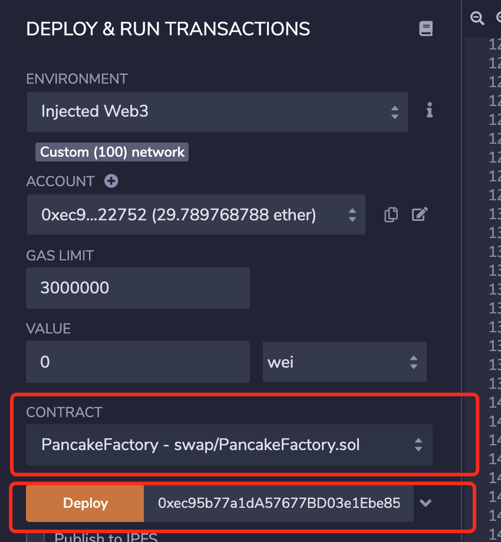
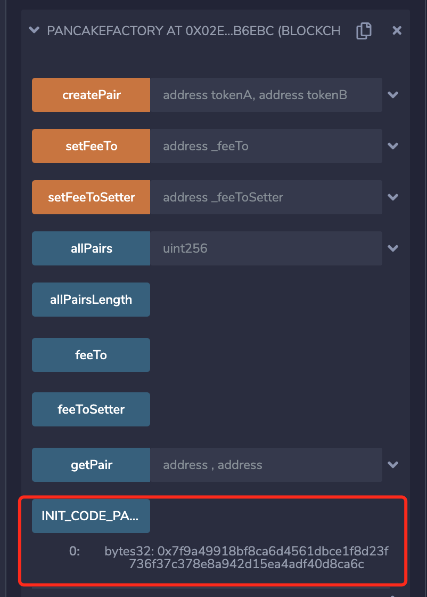
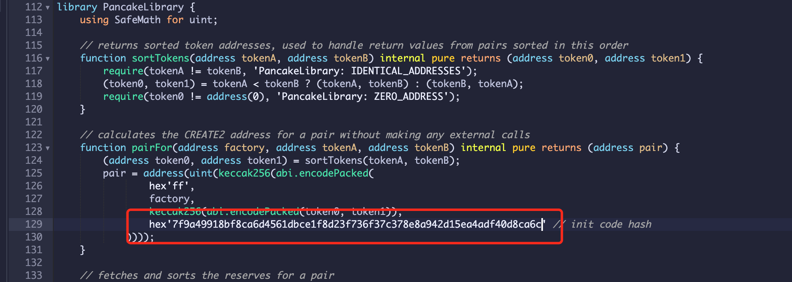
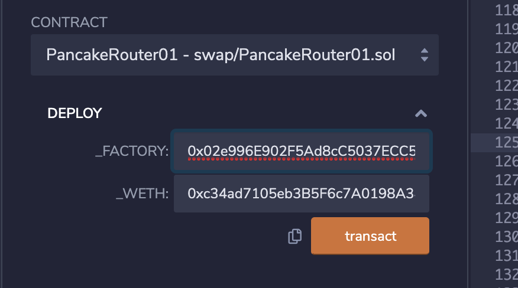
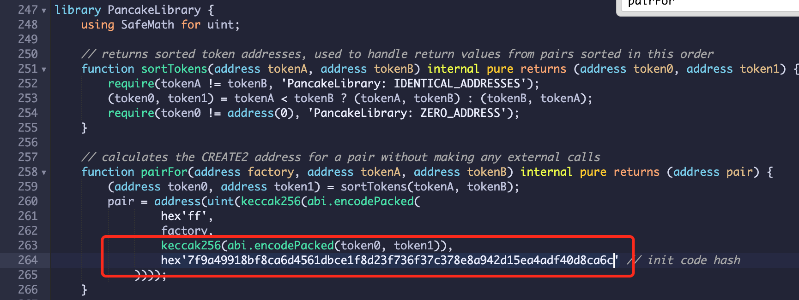

# 部署PancakeSwap

## 准备环境

- 安装node

  - 下载

  ```
  wget https://npm.taobao.org/mirrors/node/v14.15.1/node-v14.15.1-linux-x64.tar.xz
  ```

  - 解压

  ```
  tar -xvf node-v14.15.1-linux-x64.tar.xz
  
  mv node-v14.15.1-linux-x64 /usr/local/nodejs/
  
  ```

  - 添加环境变量

  ```
  vim /etc/profile
  
  export NODEJS_HOME=/usr/local/nodejs
  export PATH=${NODEJS_HOME}/bin:${PATH}
  
  source /etc/profile
  ```

​		 

- 安装yarn

```
npm install -g yarn
```

- 检验安装是否成功

```
node -v
npm -v 
yarn -v
```


## 准备Swap合约源码

- Clone `pancake-swap-core`
```
git clone git@github.com:pancakeswap/pancake-swap-core.git
cd pancake-swap-core
git checkout -b factory 3b214306770e86bc3a64e67c2b5bdb566b4e94a7
yarn install
yarn compile
```

- Clone `pancake-swap-periphery`
```
git clone git@github.com:pancakeswap/pancake-swap-periphery.git
cd pancake-swap-periphery
git checkout -b router d769a6d136b74fde82502ec2f9334acc1afc0732
yarn install
yarn add @uniswap/v2-core@"file:../pancake-swap-core"
yarn compile
```

- Clone `pancake-swap-interface-v1`
```
git clone git@github.com:pancakeswap/pancake-swap-interface-v1.git
cd pancake-swap-interface-v1
git checkout -b v1 0257017f2daaae2f67c24ded70b5829f74a01b3c
yarn install
```


## 部署

### Install contract merger: https://www.npmjs.com/package/sol-merger
```
npm install sol-merger -g
```

### Prepare `PancakeFactory` and `PancakeRouter`
```
sol-merger pancake-swap-core/contracts/PancakeFactory.sol ./build
sol-merger pancake-swap-core/contracts/PancakePair.sol ./build
sol-merger pancake-swap-periphery/contracts/PancakeRouter01.sol ./build
sol-merger pancake-swap-periphery/contracts/PancakeRouter.sol ./build
```

### Deploy `PancakeFactory` and `PancakeRouter`

- Access: https://remix.ethereum.org/#optimize=false&runs=200&evmVersion=null&version=soljson-v0.5.16+commit.9c3226ce.js

#### Deploy WBNB

+ New File: `WBNB.sol` => Copy source from https://gist.github.com/nhancv/b0b35f16472e4998d0fd17b7a1e4f707
+ Compiler tab => Select compiler: `v0.8.3+commit.8d00100c`
+ Deploy tab => Select `WBNB` -> Deploy

#### Deploy PancakeFactory

+ New File: `PancakeFactory.sol` => Copy source from `./build/PancakeFactory.sol`

+ Compiler tab => Select compiler: `v0.5.16+commit.9c3226ce`

+ Deploy tab => Select `PancakeFactory` -> Fill your address as `feeToSetter` in constructor -> Deploy

  

#### Deploy PancakeRouter01

+ New File: `PancakeRouter01.sol` => Copy source from `./build/PancakeRouter01.sol`

+ Expand `PancakeFactory` deployed above -> Read `INIT_CODE_PAIR_HASH` -> Copy this hash without prefix `0x`. Ex: `7f9a49918bf8ca6d4561dbce1f8d23f736f37c378e8a942d15ea4adf40d8ca6c`

  

+ Edit `PancakeRouter01`: Find `PancakeLibrary` -> `pairFor` function => Replace new hex by `INIT_CODE_PAIR_HASH` above. Ex: `hex'd0d4c4cd0848c93cb4fd1f498d7013ee6bfb25783ea21593d5834f5d250ece66'` -> `hex'7f9a49918bf8ca6d4561dbce1f8d23f736f37c378e8a942d15ea4adf40d8ca6c'`

  

+ Compiler tab => Select compiler: `v0.6.6+commit.6c089d02`

+ Deploy tab => Select `PancakeRouter01` -> Fill `PancakeFactory` address and `WBNB` address as constructor params -> Deploy

  

#### Deploy PancakeRouter (Main Router)

+ New File: `PancakeRouter.sol` => Copy source from `./build/PancakeRouter.sol`

+ Expand `PancakeFactory` deployed above -> Read `INIT_CODE_PAIR_HASH` -> Copy this hash without prefix `0x`. Ex: `7f9a49918bf8ca6d4561dbce1f8d23f736f37c378e8a942d15ea4adf40d8ca6c`

+ Edit `PancakeRouter`: Find `PancakeLibrary` -> `pairFor` function => Replace new hex by `INIT_CODE_PAIR_HASH` above. Ex: `hex'd0d4c4cd0848c93cb4fd1f498d7013ee6bfb25783ea21593d5834f5d250ece66'` -> `hex'7f9a49918bf8ca6d4561dbce1f8d23f736f37c378e8a942d15ea4adf40d8ca6c'`

  

+ Compiler tab => Select compiler: `v0.6.6+commit.6c089d02`; Check on `Enable optimization: 200` to avoid `Contract code size limit` issue

+ Deploy tab => Select `PancakeRouter` -> Fill `PancakeFactory` address and `WBNB` address as constructor params -> Deploy


#### 安装前端

- Update .env
```
cd pancake-swap-interface-v1
cp .env.development .env
```

- Update `PancakeRouter` address to `ROUTER_ADDRESS` at `src/constants/index.ts`
  
- Update support chain to testnet at `src/connectors/index.ts`
	+ Change from `supportedChainIds: [56, 97]` to `supportedChainIds: [97]`
	+ Change from `56` to `97`

- Update `PancakeFactory` address and code hash to `FACTORY_ADDRESS` and `INIT_CODE_HASH` at `node_modules/@pancakeswap-libs/sdk/dist/constants.d.ts`, `node_modules/@pancakeswap-libs/sdk/dist/sdk.cjs.development.js`, `node_modules/@pancakeswap-libs/sdk/dist/sdk.cjs.production.min.js` and `node_modules/@pancakeswap-libs/sdk/dist/sdk.esm.js`

- Update `PancakeFactory` address to `v2 factory`; `PancakeRouter01` address to `v2 router 01` and `PancakeRouter` address to `v2 router 02` at `src/state/swap/hooks.ts`

- Update `WBNB` address at `node_modules/@pancakeswap-libs/sdk/dist/sdk.cjs.development.js`, `node_modules/@pancakeswap-libs/sdk/dist/sdk.cjs.production.min.js`, `node_modules/@pancakeswap-libs/sdk/dist/sdk.esm.js`

- VERIFY CHANGES by `Find All` old addresses and replace new ones:

    + old

	+ WBNB:            0xaE8E19eFB41e7b96815649A6a60785e1fbA84C1e
	
	+ PancakeFactory:  0xBCfCcbde45cE874adCB698cC183deBcF17952812
	
	+ INIT_CODE_HASH:  0xd0d4c4cd0848c93cb4fd1f498d7013ee6bfb25783ea21593d5834f5d250ece66
	
	+ PancakeRouter01: 0xf164fC0Ec4E93095b804a4795bBe1e041497b92a
	
	+ PancakeRouter:   0x05fF2B0DB69458A0750badebc4f9e13aDd608C7F
	

- Deploy your own tokens
	+ Deploy your own tokens and update info (token address + chainId to 97) to `src/constants/token/pancakeswap.json`
	+ Remember update token icon with name as token address in lowercase mode to `public/images/coins`
	+ Update support network from `ChainId.MAINNET` to `ChainId.BSCTESTNET` at `src/constants/index.ts`
	+ Update coin addresses to your at `src/constants/index.ts`
	+ Update `src/components/Menu/index.tsx`: From `priceData.data[CAKE.address].price` to `priceData.data[CAKE.address]?.price ?? 0`
	+ Update `src/hooks/useGetDocumentTitlePrice.ts`: From `priceData.data[CAKE.address].price` to `priceData.data[CAKE.address]?.price ?? 0`
	
- Custom menu at `src/components/Menu/config.ts`

### Start and Build Frontend

- Start
```
yarn start
```

- Build
```
yarn build
```


### 主网地址 

- WBNB:            0xc34ad7105eb3B5F6c7A0198A346E26595A142291
- PancakeFactory:  0x02e996E902F5Ad8cC5037ECC5DCd552C565B6EBC
- INIT_CODE_HASH:  0x7f9a49918bf8ca6d4561dbce1f8d23f736f37c378e8a942d15ea4adf40d8ca6c
- PancakeRouter01: 0x0eF680193492C1cc0a34a20411bA31eeA3298eeA
- PancakeRouter:   0x3180356fa8082efEEf9523BE654c162242E4dcC0


### 测试网地址

- WBNB:            0x3180356fa8082efEEf9523BE654c162242E4dcC0
- PancakeFactory:  0x02e996E902F5Ad8cC5037ECC5DCd552C565B6EBC
- INIT_CODE_HASH:  0x7f9a49918bf8ca6d4561dbce1f8d23f736f37c378e8a942d15ea4adf40d8ca6c
- PancakeRouter01: 0x0eF680193492C1cc0a34a20411bA31eeA3298eeA
- PancakeRouter:   0x3180356fa8082efEEf9523BE654c162242E4dcC0


| token | address                                    | hash                                                         |
| ----- | ------------------------------------------ | ------------------------------------------------------------ |
| BAKE  | 0x94a42146Fab15a7EC00a8Bd95720cF0baDa65B42 | 0x6098e13955cf0853eb479f802bb4801f892258d8743f48178bd3b49e304d6bc9 |
| BUSD  | 0x7560AdfEca32ed5EC1b9101dD458e867Aec90cE3 | 0xfba1330074958956f9cff9112f51bb4589df011f3ebac3a9e891627f6f1a7811 |
| ETH   | 0xc34ad7105eb3B5F6c7A0198A346E26595A142291 | 0x0ceefc7c3d22dc3bc030ad33e62e402315a8aaae57968595d4d57b046ee5160e |
| USDT  | 0x02e996E902F5Ad8cC5037ECC5DCd552C565B6EBC | 0x95ed10809c17de41f2872708dcf646e43b4720c38293de57674454e893009db8 |
| XRP   | 0x0eF680193492C1cc0a34a20411bA31eeA3298eeA | 0x45324f79100d845ae410d666ec87cbda3a2b2650dcb3f5dae7d0ca82a99a3cbf |
| DAI   | 0x9D575ba54c57763d3b1e42957eBFE9D791DeeD39 | 0x5fda7bdadfe57e8b0334b99c7d699a5d2afdf8a2c12c2ee87ac5432cb69c8e7c |
| CAKE  | 0x4B13a328AFcc7EA26FA97436fB8a7346e6d2A6C6 | 0xc1c54f99aea29f3845c77b7a3f9b6ebfbe9aabb29a8414bacd0d879ddbfa27ed |
| WBNB  | 0x3180356fa8082efEEf9523BE654c162242E4dcC0 | 0x33c7311e0acd78c0709cbc8f2141d2d168667c7aae1e1b967a44f3a64e748b9b |


启动前端如果碰到文件limit限制使用下面命令修改

```
echo fs.inotify.max_user_watches=524288 | sudo tee -a /etc/sysctl.conf && sudo sysctl -p 

sudo sysctl --system

```